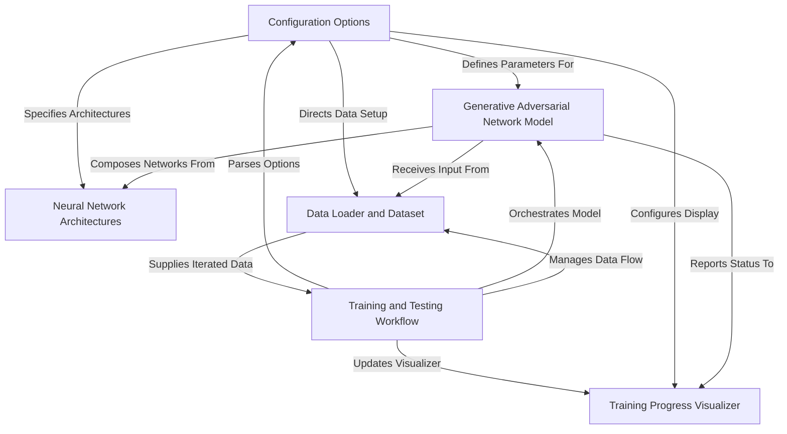
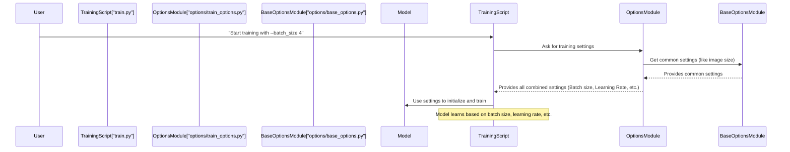
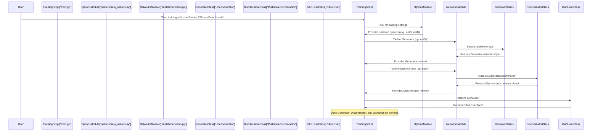
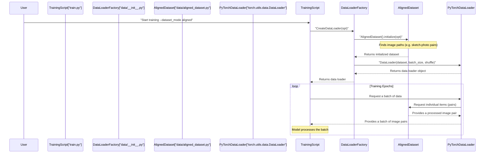
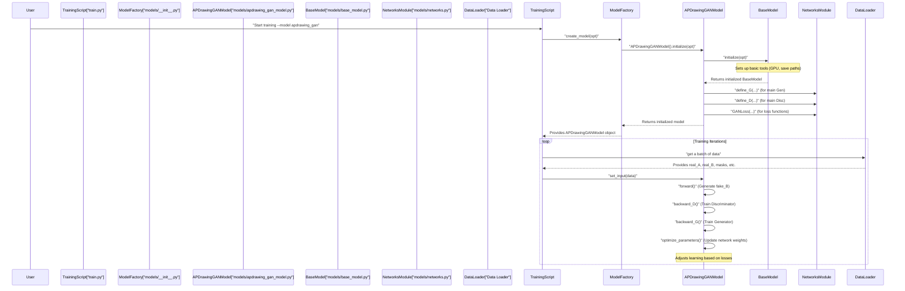
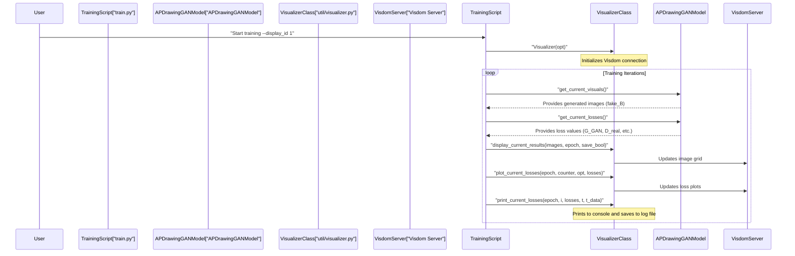
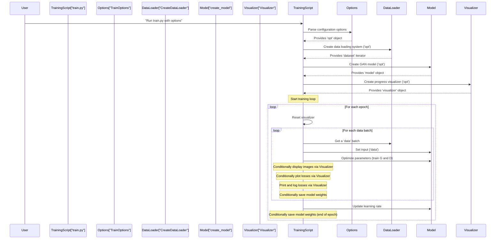
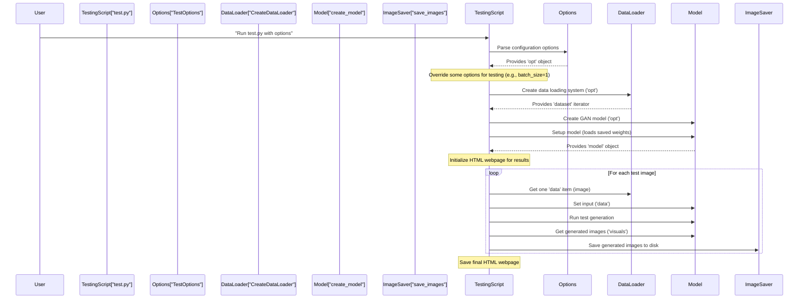

# Enhancing-Architectural-Visualisation-through-Generative-Adversarial-Networks

This project focuses on **enhancing architectural visualizations** by employing
*Generative Adversarial Networks (GANs)*. Its core purpose is to learn from
architectural sketches and associated styles to generate *realistic and high-quality
architectural images*. The system provides tools for configuring training,
managing data, defining neural network structures, and visualizing progress,
all coordinated through distinct training and testing workflows.


## Visual Overview



## Chapters

1. [Configuration Options
](01_configuration_options_.md)
2. [Neural Network Architectures
](02_neural_network_architectures_.md)
3. [Data Loader and Dataset
](03_data_loader_and_dataset_.md)
4. [Generative Adversarial Network Model
](04_generative_adversarial_network_model_.md)
5. [Training Progress Visualizer
](05_training_progress_visualizer_.md)
6. [Training and Testing Workflow
](06_training_and_testing_workflow_.md)

---

# Chapter 1: Configuration Options

Imagine you're baking a cake. You have a basic recipe (our project's core code), but you want to customize it. Maybe you want to use less sugar, bake it at a different temperature, or add sprinkles. You wouldn't rewrite the entire recipe every time, right? Instead, you'd adjust the *settings* or *options* for that bake.

In our project, "Enhancing Architectural Visualisation through Generative Adversarial Networks," we're doing something similar. We have powerful AI models that can generate images. But how do we tell these models *exactly* what to do? How do we decide things like:
*   How many images to process at once?
*   How fast should the model learn?
*   What size should the generated images be?
*   Where should we save the results?

This is where **Configuration Options** come in! Think of it as the "control panel" or "settings menu" for our entire project. It's a smart way to give instructions to our program without changing its fundamental code. This allows us to experiment flexibly and easily adapt our model to different tasks or datasets.

## Your First Custom Experiment: Setting up Training

Let's dive straight into our main use case: **training a Generative Adversarial Network (GAN) model with specific, custom settings.**

To train our model, we'll usually run a Python script, for example, `train.py`. When we run this script, we can pass it different options right from the command line. This is like telling our cake recipe: "Bake this cake, but use a *small batch size* and a *specific learning rate*."

Here's how you might tell the program to start training with some basic options:

```bash
python train.py --name my_first_experiment --batch_size 4 --lr 0.0001
```

Let's break down this command:

*   `python train.py`: This tells your computer to run our training script.
*   `--name my_first_experiment`: This is an option that gives a unique name to your experiment. All saved models and results for this training run will be stored under this name.
*   `--batch_size 4`: This sets the "batch size" to 4. Imagine feeding images to the AI model in small groups. A batch size of 4 means the model processes 4 images at a time before updating its understanding.
*   `--lr 0.0001`: This stands for "learning rate." It's a crucial setting that determines how big of a step the model takes to learn from its mistakes. A smaller learning rate means slower, more careful learning.

By changing these options, you can profoundly change how your model behaves, how quickly it learns, and the quality of the images it generates, all without touching the core logic of `train.py`!

## How Configuration Options Work (Under the Hood)

Let's peek behind the curtain to understand how these configuration options are managed.

### The Control Panel Analogy

Imagine our program as a sophisticated machine. The "Configuration Options" are the actual knobs, buttons, and switches on its control panel.



1.  **You (the User)** run the `train.py` script and specify your desired settings using command-line arguments (e.g., `--batch_size 4`).
2.  The `train.py` script doesn't hardcode these settings. Instead, it asks a special `OptionsModule` (our "control panel manager") to figure them out.
3.  The `OptionsModule` first grabs general, common settings from a `BaseOptionsModule` (like the default image size or where to save checkpoints).
4.  Then, it adds training-specific settings that are relevant only for training (like how often to display results).
5.  Finally, the `OptionsModule` gives a complete list of all these settings back to `train.py`.
6.  `train.py` then uses these settings to prepare the data, build the AI model, and start the training process.

This system is powerful because it keeps the settings separate from the actual training logic, making our project organized and flexible.

### Diving into the Code Files

Our configuration options are defined across a few Python files, primarily in the `options` folder:

*   `options/base_options.py`: Contains common options that apply to *both* training and testing.
*   `options/train_options.py`: Adds options specifically for the training process.
*   `options/test_options.py`: Adds options specifically for the testing process.

Let's look at some simplified code snippets.

#### 1. `options/base_options.py` - The Foundation

This file defines the most basic settings that almost any part of our project might need.

```python
# --- File: options/base_options.py ---
import argparse # Tool for reading command-line arguments

class BaseOptions():
    def initialize(self, parser):
        # Add a common argument: where our data is located
        parser.add_argument('--dataroot', default='/path/to/my/data', 
                            help='path to images')
        # Add another common argument: how many images in one go
        parser.add_argument('--batch_size', type=int, default=1, 
                            help='input batch size')
        # Image sizes
        parser.add_argument('--loadSize', type=int, default=512, 
                            help='scale images to this size')
        parser.add_argument('--fineSize', type=int, default=512, 
                            help='then crop to this size')
        # GPU settings
        parser.add_argument('--gpu_ids', type=str, default='0', 
                            help='gpu ids: e.g. 0,1,2')
        # Name for our experiment
        parser.add_argument('--name', type=str, default='experiment_name', 
                            help='name of the experiment')
        return parser

    # ... (other methods for gathering and printing options)
```

**Explanation:**
The `initialize` method is where we tell Python's `argparse` library about all the possible settings. Each `parser.add_argument()` line defines a new option:
*   `--dataroot`: The location of our images.
*   `--batch_size`: How many images to process in a single batch.
*   `--loadSize`, `--fineSize`: What dimensions our images should be processed at.
*   `--gpu_ids`: Which graphics processing unit (GPU) to use for faster calculations.
*   `--name`: The name for our specific experiment.

These are like the universal settings found on any appliance.

#### 2. `options/train_options.py` - Training Specific Settings

This file builds upon `BaseOptions` and adds settings that are *only* relevant when we are training our model.

```python
# --- File: options/train_options.py ---
from .base_options import BaseOptions # Import common options

class TrainOptions(BaseOptions):
    def initialize(self, parser):
        # Start with all the common options from BaseOptions
        parser = BaseOptions.initialize(self, parser) 
        
        # Add specific training options:
        # How often to show results while training
        parser.add_argument('--display_freq', type=int, default=40, 
                            help='frequency of showing training results')
        # Learning rate
        parser.add_argument('--lr', type=float, default=0.0002, 
                            help='initial learning rate for adam')
        # How many training iterations to run
        parser.add_argument('--niter', type=int, default=100, 
                            help='# of iter at starting learning rate')
        # Weight for L1 loss (a type of error measurement)
        parser.add_argument('--lambda_L1', type=float, default=100.0, 
                            help='weight for L1 loss')
        
        self.isTrain = True # This tells the system we are in training mode
        return parser
```

**Explanation:**
`TrainOptions` *inherits* from `BaseOptions`. This means it automatically gets all the options defined in `BaseOptions` first. Then, it adds its own:
*   `--display_freq`: How often to update the visual display of our training progress.
*   `--lr`: The "learning rate" for our model.
*   `--niter`: The number of training iterations.
*   `--lambda_L1`: A parameter to control how much one specific type of error (L1 loss) influences the model's learning.

These are like the "oven temperature" or "baking time" settings specific to baking.

#### 3. `options/test_options.py` - Testing Specific Settings

Similarly, this file defines options important for when we are evaluating (testing) our trained model.

```python
# --- File: options/test_options.py ---
from .base_options import BaseOptions # Import common options

class TestOptions(BaseOptions):
    def initialize(self, parser):
        # Start with all the common options from BaseOptions
        parser = BaseOptions.initialize(self, parser)
        
        # Add specific testing options:
        # Where to save the generated test results
        parser.add_argument('--results_dir', type=str, default='./ours_I2S_results/', 
                            help='saves results here.')
        # Which specific saved model (epoch) to use for testing
        parser.add_argument('--which_epoch', type=str, default='100', 
                            help='which epoch to load?')
        # How many test images to process
        parser.add_argument('--how_many', type=int, default=2000, 
                            help='how many test images to run')

        self.isTrain = False # This tells the system we are in testing mode
        return parser
```

**Explanation:**
`TestOptions` also inherits from `BaseOptions`. It adds options like:
*   `--results_dir`: The folder where the generated images and other testing results will be saved.
*   `--which_epoch`: When training, the model saves checkpoints at different "epochs" (full passes over the dataset). This option lets us choose which saved model to load for testing.
*   `--how_many`: The total number of images from the test dataset to process.

These are like the "serving size" or "garnish" settings specific to serving the cake after it's baked.

#### Putting It All Together: `parse()`

When you run `train.py` (or `test.py`), a special `parse()` method is called. This method is smart enough to combine all the relevant options (`BaseOptions`, plus `TrainOptions` or `TestOptions`, and even some model-specific options later on) and present them in one easy-to-use object.

```python
# --- File: options/base_options.py (Simplified parse method) ---
import argparse
# ... other imports and class definitions ...

class BaseOptions():
    # ... initialize and other methods ...

    def gather_options(self):
        parser = argparse.ArgumentParser() # Create a new argument parser
        parser = self.initialize(parser) # Add base options
        
        # This part is simplified, but in reality, it dynamically
        # adds options specific to the chosen model and dataset type.
        # For our example, imagine it also adds TrainOptions arguments.

        opt, _ = parser.parse_known_args() # Read the arguments from the command line
        return opt

    def parse(self):
        opt = self.gather_options() # Get all the collected options
        opt.isTrain = self.isTrain # Set whether it's train or test mode
        
        # For demonstration, let's print some of the options we set
        print(f"Experiment Name: {opt.name}")
        print(f"Batch Size: {opt.batch_size}")
        if opt.isTrain:
            print(f"Learning Rate (Train): {opt.lr}")
        else:
            print(f"Results Directory (Test): {opt.results_dir}")
        
        self.opt = opt # Store the final options
        return self.opt

# Example usage in train.py (conceptually)
# opt = TrainOptions().parse() # Calls the parse method to get all settings
# print(opt.name) # Access specific settings like this
```

**Explanation:**
The `parse()` method (which uses `gather_options()` internally) is the magic orchestrator. It creates a robust parser, feeds it all the basic, training-specific, model-specific, and dataset-specific options. Then, when you run your script, it reads what you typed on the command line, matches it to these defined options, and creates a neat `opt` object that holds all your chosen settings. This `opt` object then becomes the central instruction manual for the rest of your program.

## Conclusion

You've learned that **Configuration Options** are your project's command center. They allow you to control how your Generative Adversarial Networks train and test by adjusting settings like learning rates, image sizes, and output directories, all without altering the core code. This flexibility is crucial for experimenting and fine-tuning your architectural visualization models.

By using command-line arguments and understanding how `BaseOptions`, `TrainOptions`, and `TestOptions` work together, you can now confidently steer your GAN experiments!

Next, we'll dive into the fundamental building blocks of our AI models: the **Neural Network Architectures**. You'll see how these settings you just learned about, like `--netG` and `--netD`, actually define the structure of our generative and discriminative networks.

[Next Chapter: Neural Network Architectures](02_neural_network_architectures_.md)

---

# Chapter 2: Neural Network Architectures

In [Chapter 1: Configuration Options](01_configuration_options_.md), we learned how to set up the 'rules' and 'settings' for our AI project, like the batch size and learning rate. Think of it like deciding the ingredients and oven temperature for baking a special cake. But what kind of cake are we actually making? Is it a fluffy sponge or a rich chocolate fudge? This is where **Neural Network Architectures** come in.

Imagine you're building a highly specialized robot. Chapter 1 was about setting its overall parameters—how fast it moves, how much power it uses. Now, we need to decide *what kind of robot it is* and *what parts it has*. Is it a robot arm for intricate tasks, or a large, wheeled robot for heavy lifting? Each type of robot has a different internal structure, right?

Our project, "Enhancing Architectural Visualisation through Generative Adversarial Networks," uses AI robots to generate images. These 'robots' are our **Generative Adversarial Networks (GANs)**. A GAN is made of two main parts:
1.  **The Generator (G):** The 'artist' robot that creates images.
2.  **The Discriminator (D):** The 'critic' robot that judges if the generated images look real or fake.

The **Neural Network Architectures** define the internal blueprints for these Generator and Discriminator robots. They are the "toolkit" that contains different designs for how these robots are built. Choosing the right architecture is like picking the right kind of robot for the job – it's crucial for getting high-quality architectural visualizations.

**Our main goal in this chapter is to understand how we select and configure these specific blueprints for our Generator and Discriminator.** For example, we might want our Generator to excel at capturing fine details, or our Discriminator to be very good at spotting subtle inconsistencies across an entire image.

## Understanding the Blueprints: Generators, Discriminators, and More

Let's look at some of the common blueprints available in our toolkit:

### Generators (The Artists)

These are the networks responsible for creating the architectural visualizations. Different blueprints help them specialize:

*   **ResNet-based Generators:** These are like experienced artists. They are good at taking an input (like a simple sketch) and transforming it into a complex output (a detailed painting) while preserving much of the original structure. They use 'residual blocks,' which help prevent the network from 'forgetting' information as it gets deeper, allowing for stable transformations.
*   **U-Net-based Generators:** Think of these as super-detailed architects. U-Nets are famous for their 'U' shape, where they first shrink the image (encoding) to understand the big picture, then expand it back (decoding), bringing back fine details through 'skip connections.' This makes them excellent for tasks like image-to-image translation where precise detail and alignment are important.

### Discriminators (The Critics)

These networks act as critics, judging whether the Generator's creations are realistic enough:

*   **PatchGAN Discriminator:** This critic doesn't judge the entire image at once. Instead, it looks at many smaller 'patches' (like small sections of a painting) and decides if *each patch* looks real. If all the patches look real, then the whole image is considered real. This approach helps ensure local realism and texture quality.
*   **Multiscale Discriminator:** This is a very thorough critic! It examines the image at several different sizes (scales). It checks if the image looks real when it's small and blurry, and also when it's large and detailed. This helps catch inconsistencies at both a global and local level, leading to more robust image generation.

### Specialized Components (The Scoring Systems & Style Guides)

Beyond the main Generator and Discriminator, our project uses other important architectural components:

*   **`GANLoss` Function:** This is the core 'scorecard' for the GAN competition. It measures how well the Generator is fooling the Discriminator, and how well the Discriminator is spotting fakes. It's the mathematical goal that guides both networks to get better.
*   **VGG Perceptual Loss (or simply Perceptual Loss):** Sometimes, we want our generated images to not just be 'pixel-perfect' but also 'perceptually similar' to real images, meaning they *feel* real and aesthetically pleasing to a human eye. The VGG Perceptual Loss uses features learned by a powerful pre-trained image recognition network (VGG19) to compare the high-level 'style' and 'content' of images, ensuring the generated images look artistically appealing and realistic.

## Your First Custom Experiment: Choosing Network Blueprints

Remember how in [Chapter 1: Configuration Options](01_configuration_options_.md) we passed command-line arguments to our `train.py` script? This is exactly how we tell our project which Generator and Discriminator blueprints to use! The options `--netG` and `--netD` are specifically for this purpose.

Let's say you want to use a **U-Net** for your Generator (because you want fine details in your architectural visualizations) and a **Multiscale Discriminator** (to ensure realism at various levels). You would run your training script like this:

```bash
python train.py --name detailed_arch_gen --netG unet_256 --netD multiscale
```

When you run this command:
*   `--name detailed_arch_gen`: Gives your experiment a unique name.
*   `--netG unet_256`: Tells the system to build the Generator using the U-Net blueprint, specifically one designed for images up to 256x256 pixels (the `_256` often implies the highest resolution it handles or the depth of the network).
*   `--netD multiscale`: Tells the system to build the Discriminator using the Multiscale blueprint, making it a robust critic.

Behind the scenes, the project will take these choices and assemble the correct neural network structures based on these blueprints. It's like calling up a construction team and telling them, "Build me a house with *this* architectural plan for the main structure and *that* plan for the security system!"

## How Network Blueprints Work (Under the Hood)

Let's peek into the 'control room' to see how these blueprints are actually put together. The magic happens primarily in the `models/networks.py` file.



Here's a simplified explanation of what happens:
1.  **You** specify your desired Generator (`--netG`) and Discriminator (`--netD`) types using command-line arguments.
2.  The `train.py` script, after getting all options from the [Configuration Options](01_configuration_options_.md) system, calls special functions in `models/networks.py` to `define_G` (define Generator) and `define_D` (define Discriminator).
3.  These `define_G` and `define_D` functions act as 'factory managers.' They look at your `--netG` and `--netD` choices and then instantiate (create an instance of) the corresponding Python class for that network architecture (e.g., `UnetGenerator` or `MultiscaleDiscriminator`).
4.  Each of these architectural classes then builds its specific neural network structure, layer by layer.
5.  Finally, the `train.py` script also initializes crucial components like the `GANLoss` function, which will be used to calculate how well the GAN is performing during training.

### Diving into the Code Files

Let's look at some simplified snippets from `models/networks.py` to see these blueprints in action.

#### 1. `define_G` and `define_D` - The Network Factories

These functions are your main entry points for building networks. They take arguments like `netG` (e.g., `'unet_256'`) or `netD` (e.g., `'multiscale'`) and, based on your choice, they decide which specific `nn.Module` (a basic neural network component in PyTorch) class to use.

```python
# --- Simplified File: models/networks.py ---
import torch.nn as nn
import functools

# Helper function (defined elsewhere in the file) to get normalization layers
def get_norm_layer(norm_type='instance'):
    # ... returns a specific normalization layer (e.g., BatchNorm2d or InstanceNorm2d) ...
    pass

# Helper to define Generator
def define_G(input_nc, output_nc, ngf, netG, norm='batch', use_dropout=False, gpu_ids=[]):
    net = None
    norm_layer = get_norm_layer(norm_type=norm) # Get chosen normalization layer

    # Based on the 'netG' option, create the right Generator blueprint
    if netG == 'resnet_9blocks':
        net = ResnetGenerator(input_nc, output_nc, ngf, norm_layer=norm_layer, n_blocks=9)
    elif netG == 'unet_256': # Our chosen U-Net for 256x256 images
        net = UnetGenerator(input_nc, output_nc, 8, ngf, norm_layer=norm_layer, use_dropout=use_dropout)
    # ... other generator types omitted for brevity ...
    else:
        raise NotImplementedError('Generator model name [%s] is not recognized' % netG)
    
    # Initialize weights and move the network to GPU if available (init_net also defined in file)
    return init_net(net, 'normal', 0.02, gpu_ids)

# Helper to define Discriminator
def define_D(input_nc, ndf, netD, n_layers_D=3, norm='batch', use_sigmoid=False, gpu_ids=[]):
    net = None
    norm_layer = get_norm_layer(norm_type=norm) # Get chosen normalization layer

    # Based on the 'netD' option, create the right Discriminator blueprint
    if netD == 'n_layers': # This is often referred to as PatchGAN
        net = NLayerDiscriminator(input_nc, ndf, n_layers_D, norm_layer=norm_layer, use_sigmoid=use_sigmoid)
    elif netD == 'multiscale': # Our chosen Multiscale Discriminator
        net = MultiscaleDiscriminator(input_nc, ndf, n_layers_D, norm_layer=norm_layer, num_D=2, getIntermFeat=True)
    # ... other discriminator types omitted for brevity ...
    else:
        raise NotImplementedError('Discriminator model name [%s] is not recognized' % netD)
    
    # Initialize weights and move the network to GPU if available
    return init_net(net, 'normal', 0.02, gpu_ids)
```

**Explanation:**
These `define_G` and `define_D` functions act like switches. When you specify `--netG unet_256`, the `define_G` function identifies `'unet_256'` and then creates an actual `UnetGenerator` object. Similarly for the Discriminator. This approach cleanly separates the "choice" of architecture from the "building" of it.

#### 2. `UnetGenerator` - A Generator Blueprint Example

Let's look at a very simplified version of what a `UnetGenerator` class might contain. In reality, these classes are much longer, defining many layers, but the core idea is simple: they assemble smaller building blocks.

```python
# --- Simplified UnetGenerator blueprint class (inside models/networks.py) ---
class UnetGenerator(nn.Module):
    def __init__(self, input_nc, output_nc, num_downs, ngf=64, norm_layer=None, use_dropout=False):
        super(UnetGenerator, self).__init__()
        # Here, the complex 'U' structure with downsampling,
        # skip connections, and upsampling is built.
        # This part is highly simplified to show the concept.
        
        # The Unet is built from many UnetSkipConnectionBlock parts
        # The outermost block wraps the entire U-structure
        unet_block = UnetSkipConnectionBlock(output_nc, ngf, input_nc=input_nc, 
                                            submodule=None, outermost=True, norm_layer=norm_layer)
        self.model = unet_block # The entire UNet is assembled here
        print(f"UnetGenerator created with {num_downs} downsampling steps.")

    def forward(self, input):
        # This is where the image flows through the network
        return self.model(input)

# --- A building block of the Unet (simplified) ---
class UnetSkipConnectionBlock(nn.Module):
    def __init__(self, outer_nc, inner_nc, input_nc=None, submodule=None, outermost=False, innermost=False, norm_layer=None):
        super(UnetSkipConnectionBlock, self).__init__()
        # This block defines parts of the U-Net's structure.
        # It typically includes a convolutional layer for downsampling,
        # an activation function, and then potentially an upsampling layer.
        # It also handles the 'skip connection' which passes information 
        # from the downsampling path to the upsampling path, helping preserve details.
        
        self.model = nn.Sequential(
            nn.Conv2d(input_nc or outer_nc, inner_nc, kernel_size=4, stride=2, padding=1),
            nn.LeakyReLU(0.2, True)
            # ... and more layers for the full block in the actual code ...
        )

    def forward(self, x):
        # For simplicity, we just show x going through the model.
        # In a real U-Net, this block combines its input (x)
        # with the output of its 'submodule' (the inner part of the U-Net).
        return self.model(x)
```

**Explanation:**
The `UnetGenerator` is a big blueprint that uses smaller blueprints called `UnetSkipConnectionBlock`s. Each `UnetSkipConnectionBlock` represents a part of the 'U' shape, handling downsampling (making the image smaller), upsampling (making it larger), and connecting these two paths directly (the 'skip connection'). When `UnetGenerator` is created, it recursively calls these smaller blocks to build its entire, complex structure. This modular design makes it easier to build and understand complex networks.

#### 3. `GANLoss` - The Scorecard

```python
# --- Simplified GANLoss class (inside models/networks.py) ---
import torch

class GANLoss(nn.Module):
    def __init__(self, use_lsgan=True, target_real_label=1.0, target_fake_label=0.0):
        super(GANLoss, self).__init__()
        # Store constant labels (real/fake) that the network learns to aim for
        self.register_buffer('real_label', torch.tensor(target_real_label))
        self.register_buffer('fake_label', torch.tensor(target_fake_label))
        
        # Choose the specific loss function (e.g., Mean Squared Error or Binary Cross Entropy)
        if use_lsgan: # LSGAN often uses Mean Squared Error (MSELoss)
            self.loss = nn.MSELoss()
        else: # Standard GAN often uses Binary Cross Entropy (BCEWithLogitsLoss)
            self.loss = nn.BCEWithLogitsLoss()

    # Helper to get the correct target tensor (all real or all fake)
    def get_target_tensor(self, input, target_is_real):
        if target_is_real:
            target_tensor = self.real_label
        else:
            target_tensor = self.fake_label
        return target_tensor.expand_as(input) # Make target tensor same size as input

    def __call__(self, input, target_is_real):
        # This method is called during training to calculate the loss
        # It gets the network's prediction ('input') and whether it should be 'real' or 'fake'.
        # It then compares them using the chosen loss function.
        target_tensor = self.get_target_tensor(input[-1], target_is_real)
        return self.loss(input[-1], target_tensor)
```

**Explanation:**
`GANLoss` is a special function that calculates how 'wrong' our networks are. When the Discriminator sees a real image, we want it to output a value close to `target_real_label` (usually 1.0). When it sees a fake image, we want it to output `target_fake_label` (usually 0.0). `GANLoss` computes the difference between what the Discriminator *should* output and what it *actually* outputs, providing a 'score' that tells the network how to adjust itself. This score is fundamental for training the Generator to create convincing images and the Discriminator to become a better judge.

#### 4. `Vgg19` and `VGGLoss` - The Style Judge

```python
# --- Simplified Vgg19 class (inside models/networks.py) ---
from torchvision import models # Imports pre-trained VGG model
import torch.nn.functional as F # For activation functions

class Vgg19(torch.nn.Module):
    def __init__(self, requires_grad=False):
        super(Vgg19, self).__init__()
        # Load a powerful image recognition model (VGG19) already trained on millions of images
        vgg_pretrained_features = models.vgg19(pretrained=True).features
        # We extract specific layers from VGG19 to use their learned features
        self.slice1 = torch.nn.Sequential(*vgg_pretrained_features[:2])
        self.slice2 = torch.nn.Sequential(*vgg_pretrained_features[2:7])
        # ... more slices (slice3, slice4, slice5) ...
        print("Vgg19 model loaded for perceptual loss calculation.")
        if not requires_grad:
            for param in self.parameters():
                param.requires_grad = False # Freeze VGG; we just use its features, not train it

    def forward(self, X):
        # Pass an image through VGG to get its learned features at different depths
        h_relu1 = self.slice1(X)
        h_relu2 = self.slice2(h_relu1)        
        # ... more feature outputs from other slices ...
        out = [h_relu1, h_relu2] # Simplified output for illustration
        return out

# --- Simplified VGGLoss class (inside models/networks.py) ---
class VGGLoss(nn.Module):
    def __init__(self, gpu_ids):
        super(VGGLoss, self).__init__()        
        self.vgg = Vgg19().cuda() # Create an instance of our Vgg19 feature extractor
        self.criterion = nn.L1Loss() # Use L1 loss to compare features
        self.weights = [1.0/32, 1.0/16] # Weights for different VGG layers (simplified)

    def forward(self, x, y):        
        x_vgg, y_vgg = self.vgg(x), self.vgg(y) # Get VGG features for generated (x) and real (y) images
        loss = 0
        for i in range(len(x_vgg)):
            # Calculate difference in features, weighted by layer depth
            loss += self.weights[i] * self.criterion(x_vgg[i], y_vgg[i].detach())        
        return loss
```

**Explanation:**
The `Vgg19` class loads a powerful, pre-trained neural network (VGG19) and chops it into 'slices.' Each slice captures different levels of visual information, from simple edges to complex textures. `VGGLoss` then uses these slices to compare how 'similar' two images are, not just pixel-by-pixel, but in terms of their artistic style and content. This "perceptual" comparison is very important for making architectural renderings look visually appealing and realistic, beyond just matching raw pixel values.

## Conclusion

You've now seen how **Neural Network Architectures** are the fundamental blueprints for our AI models. You learned about different types of Generators (like ResNet and U-Net) and Discriminators (like PatchGAN and Multiscale), and how specialized components like `GANLoss` and VGG Perceptual Loss guide their learning. By simply adjusting command-line options like `--netG` and `--netD`, you can profoundly change the 'brains' of your AI, tailoring it for specific architectural visualization tasks.

In the next chapter, we'll shift our focus from the AI's brains to its 'food': the **[Data Loader and Dataset](03_data_loader_and_dataset_.md)**. We'll learn how we prepare and feed images to these powerful neural networks so they can learn to generate stunning architectural visuals.

[Next Chapter: Data Loader and Dataset](03_data_loader_and_dataset_.md)

---

# Chapter 3: Data Loader and Dataset

In [Chapter 2: Neural Network Architectures](02_neural_network_architectures_.md), we explored the 'brains' of our AI models, the Generators and Discriminators, and how we select their blueprints. Now that we know *what kind* of AI models we're building, we need to think about *what* we're feeding them. Just like a chef needs fresh, prepared ingredients for a recipe, our AI needs well-organized and preprocessed images to learn from.

Imagine you're training a dog. You don't just dump a giant bag of kibble on the floor and expect it to learn tricks. You portion out the food, perhaps chop up some treats, and feed them to the dog in a structured way during training sessions.

In our project, "Enhancing Architectural Visualisation through Generative Adversarial Networks," our "dog" is the GAN model. The "food" is the massive collection of architectural images (sketches, photos, masks, etc.). Managing this "food" is a huge task! We can't just throw raw image files at our neural networks. We need a systematic way to:
1.  **Find** all the images.
2.  **Load** them into memory.
3.  **Transform** them (resize, crop, normalize colors).
4.  **Organize** them into groups (batches) for efficient processing.
5.  **Deliver** them to the AI model one batch at a time.

This crucial "food delivery service" is handled by the **Data Loader and Dataset** system. It's the mechanism that ensures our GAN model gets a steady, well-prepared stream of images to learn from, making the training process smooth and efficient.

**Central Use Case:** Training a GAN to transform architectural sketches into realistic images. For this, our GAN needs *pairs* of images: an input sketch and its corresponding realistic photo, along with any extra helpful information like masks or landmark points.

## Understanding the Food Delivery Service: Key Concepts

Our data system is built on a few core ideas:

*   **`BaseDataset` (The General Recipe Book):** This is the foundation, defining the common rules for *any* dataset we might want to use. It sets up basic expectations, like how to get the total number of items in the dataset or how to apply general image transformations (e.g., resizing).
*   **`AlignedDataset` (The Specialized Recipe):** Building on `BaseDataset`, this is a specific recipe tailored for our task of image-to-image translation. It's designed to load *pairs* of images (like a sketch and its matching photo), ensuring they are always correctly aligned. It also handles loading extra details, like **landmark points** (specific points on the architecture, e.g., corners of a window) or **masks** (areas of the image highlighting certain features like the roof or sky), which give our GAN more context.
*   **`DataLoader` (The Efficient Delivery Service):** Once our `AlignedDataset` has prepared individual image pairs, the `DataLoader` steps in. It's like the kitchen staff that groups these prepared image pairs into "batches" (small groups of images). Instead of processing one image at a time, GANs learn much faster when fed a batch of images simultaneously. The `DataLoader` also handles loading these batches efficiently, often using multiple CPU cores, so our powerful GPU is never left waiting for data.

## Your First Custom Experiment: Specifying Your Data (User Perspective)

Remember how in [Chapter 1: Configuration Options](01_configuration_options_.md) we passed command-line arguments to our `train.py` script? This is exactly how we tell our project which dataset and data loading strategy to use!

To train our GAN with the `AlignedDataset` (which handles sketch-to-photo pairs) and specify where your images are located, you would use options like `--dataset_mode` and `--dataroot`:

```bash
python train.py --name sketch_to_photo_gan \
                --dataroot /path/to/your/architectural_dataset \
                --dataset_mode aligned \
                --batch_size 4
```

Let's break down this command:

*   `python train.py`: Runs our training script.
*   `--name sketch_to_photo_gan`: Gives our experiment a unique name.
*   `--dataroot /path/to/your/architectural_dataset`: This option tells the system the main folder where all your architectural images are stored.
*   `--dataset_mode aligned`: This is the crucial option that tells our project to use the `AlignedDataset`. This means the system will expect pairs of images (e.g., `image_0001_photo.jpg` and `image_0001_sketch.jpg`) and will load them together.
*   `--batch_size 4`: This option tells the `DataLoader` to group 4 image pairs together before feeding them to the GAN model.

When you run this, our project will automatically:
1.  Locate the specified `dataroot`.
2.  Use the `aligned` dataset mode to find all relevant image pairs (like sketches and photos).
3.  Load each pair, resize and crop them as configured (e.g., to `loadSize` and `fineSize` from `base_options.py`).
4.  Optionally, apply random flipping for data augmentation.
5.  Group 4 such prepared pairs into a single batch.
6.  Efficiently deliver these batches to the GPU for GAN training.

This seamless data preparation is vital for successful GAN training!

## How Data Loader and Dataset Work (Under the Hood)

Let's peek behind the scenes to see how our project manages this "food delivery service."



Here's a step-by-step breakdown:

1.  **You (the User)** start `train.py`, specifying `--dataset_mode aligned`.
2.  The `train.py` script needs data, so it calls a special "factory" function, `CreateDataLoader`, found in `data/__init__.py`.
3.  The `CreateDataLoader` function first figures out *which* specific dataset class to use based on `opt.dataset_mode` (in our case, `AlignedDataset`). It then creates an instance of this dataset and initializes it (telling it where the images are).
4.  The `AlignedDataset` then goes through your `dataroot` folder, finds all the relevant image paths (e.g., matching sketch and photo files), and prepares itself to provide these image pairs one by one when asked.
5.  After the dataset is ready, `CreateDataLoader` then creates a `torch.utils.data.DataLoader`. This is the core "delivery service" from the PyTorch library. It's configured with our `AlignedDataset`, the `batch_size`, and whether to `shuffle` the data (mix it up for better training).
6.  Finally, this `DataLoader` object is returned to `train.py`.
7.  During training, `train.py` repeatedly asks the `DataLoader` for a "batch" of images. The `DataLoader` efficiently fetches individual image pairs from `AlignedDataset`, groups them, applies final transformations (like normalization), and delivers a complete batch to the model.

This system ensures that our GAN always has the right "food" delivered in the right way, allowing it to focus on learning and generating amazing architectural visualizations.

### Diving into the Code Files

Let's look at some simplified code snippets from the `data` folder to understand these components better.

#### 1. `data/base_dataset.py` - The Blueprint for All Datasets

This file defines the `BaseDataset` class, which is like an abstract contract that all specific datasets (like `AlignedDataset`) must follow. It ensures a common structure.

```python
# --- File: data/base_dataset.py ---
import torch.utils.data as data
from PIL import Image
import torchvision.transforms as transforms

class BaseDataset(data.Dataset): # Inherits from PyTorch's Dataset
    def __init__(self):
        super(BaseDataset, self).__init__()

    def name(self):
        return 'BaseDataset'

    def initialize(self, opt):
        # Specific datasets will use this to set up their paths, etc.
        pass

    def __len__(self):
        # Every dataset must tell us how many items it has.
        return 0 # Default is 0, specific datasets will override this

# Helper function to apply image transformations (resizing, cropping, etc.)
def get_transform(opt):
    transform_list = []
    if opt.resize_or_crop == 'resize_and_crop':
        transform_list.append(transforms.Resize([opt.loadSize, opt.fineSize], Image.BICUBIC))
        transform_list.append(transforms.RandomCrop(opt.fineSize))
    # ... more transformation options omitted for brevity ...

    transform_list += [transforms.ToTensor(), # Convert image to PyTorch tensor
                       transforms.Normalize((0.5, 0.5, 0.5), # Normalize pixel values to [-1, 1]
                                            (0.5, 0.5, 0.5))]
    return transforms.Compose(transform_list)
```

**Explanation:**
The `BaseDataset` gives us a template. Crucially, it inherits from `torch.utils.data.Dataset`, which is PyTorch's standard way to handle collections of data. Any class inheriting from `BaseDataset` (and thus `torch.utils.data.Dataset`) *must* provide a `__len__` method (to tell how many items are in the dataset) and a `__getitem__` method (to load a specific item by its index).
The `get_transform` function is a helpful utility to create a sequence of image processing steps (like resizing and color normalization) based on the options you set in [Chapter 1: Configuration Options](01_configuration_options_.md) (e.g., `--loadSize`, `--fineSize`).

#### 2. `data/aligned_dataset.py` - The Specialized Image Pair Loader

This is where the magic happens for loading our architectural sketch-to-photo pairs. It extends `BaseDataset` to handle our specific image format and additional contextual data.

```python
# --- File: data/aligned_dataset.py (Simplified) ---
import os.path
import random
import torchvision.transforms as transforms
import torch
from data.base_dataset import BaseDataset # Import our base template
from data.image_folder import make_dataset # Utility to find image files
from PIL import Image
import numpy as np # For numerical operations
# ... other imports for landmark points, masks, etc. ...

class AlignedDataset(BaseDataset):
    def initialize(self, opt):
        self.opt = opt
        self.root = opt.dataroot
        # Find all image paths in the root directory
        self.A_paths = sorted(make_dataset(self.root, opt.data_json)) # A_paths will be like photo paths

        # Store style information from a JSON file (e.g., modern, classical)
        self.style_dict = {}
        # ... logic to load style_dict from JSON files ...

    def __getitem__(self, index):
        # This method is called by the DataLoader to get one item (an image pair)
        A_path = self.A_paths[index]
        # B_path is derived from A_path, assuming a naming convention (e.g., 'photo' vs 'sketch')
        B_path = A_path.replace('photo', 'sketch').replace('image', 'sketch')

        A = Image.open(A_path).convert('RGB') # Load the 'A' image (e.g., photo)
        B = Image.open(B_path).convert('RGB') # Load the 'B' image (e.g., sketch)

        # Resize and crop images according to command line options (--loadSize, --fineSize)
        A = A.resize((self.opt.loadSize, self.opt.loadSize), Image.BICUBIC)
        B = B.resize((self.opt.loadSize, self.opt.loadSize), Image.BICUBIC)
        
        # Convert to PyTorch tensors and normalize pixel values to [-1, 1]
        A = transforms.ToTensor()(A)
        B = transforms.ToTensor()(B)
        A = transforms.Normalize((0.5, 0.5, 0.5), (0.5, 0.5, 0.5))(A)
        B = transforms.Normalize((0.5, 0.5, 0.5), (0.5, 0.5, 0.5))(B)

        # Apply random cropping and horizontal flipping (data augmentation)
        w_offset = random.randint(0, max(0, self.opt.loadSize - self.opt.fineSize - 1))
        h_offset = random.randint(0, max(0, self.opt.loadSize - self.opt.fineSize - 1))
        A = A[:, h_offset:h_offset + self.opt.fineSize, w_offset:w_offset + self.opt.fineSize]
        B = B[:, h_offset:h_offset + self.opt.fineSize, w_offset:w_offset + self.opt.fineSize]
        if (not self.opt.no_flip) and random.random() < 0.5:
            idx = [i for i in range(A.size(2) - 1, -1, -1)]
            idx = torch.LongTensor(idx)
            A = A.index_select(2, idx)
            B = B.index_select(2, idx)

        # Retrieve architectural style label and create a one-hot encoded tensor
        basenB = B_path.split('/')[-2] + '/' + B_path.split('/')[-1]
        style_label = self.style_dict[os.path.splitext(basenB.split('/')[-1])[0]]
        B_style = torch.Tensor([0.,0.,0.]) # Assuming 3 styles for simplicity
        B_style[style_label] = 1.
        B_style = B_style.view(3, 1, 1).repeat(1, self.opt.fineSize, self.opt.fineSize)

        item = {'A': A, 'B': B, 'A_paths': A_path, 'B_paths': B_path, 
                'style': B_style, 'label': style_label}
        
        # Load and process landmark points and masks if 'use_local' option is enabled
        if self.opt.use_local:
            # ... detailed logic for loading landmark points (feats) and creating masks ...
            # These provide fine-grained control over specific architectural regions.
            pass

        return item

    def __len__(self):
        return len(self.A_paths) # Returns the total number of image pairs
```

**Explanation:**
The `AlignedDataset` is the heart of our data preparation.
*   The `initialize` method is called once to find all the paths to the images and load any supplementary data like the `style_dict`.
*   The `__getitem__(index)` method is called repeatedly by the `DataLoader`. For each `index`, it:
    1.  Constructs the paths for both the input image (`A_path`, e.g., a photo) and the target image (`B_path`, e.g., a sketch) by following a naming convention.
    2.  Loads them using `PIL.Image`.
    3.  Applies common transformations like resizing, cropping, and color normalization to make them suitable for the neural network.
    4.  Applies data augmentation like random horizontal flipping to increase data variety.
    5.  It also loads the architectural `style_label` and converts it into a special `B_style` tensor that the GAN can use as additional input.
    6.  Critically, if `--use_local` is enabled (a configuration option from [Chapter 1: Configuration Options](01_configuration_options_.md)), it loads **landmark points** (e.g., coordinates of specific architectural features) and computes **masks** (binary images highlighting regions like the roof or glass). These rich contextual inputs allow the GAN to focus its generation on specific parts of the architecture with greater precision.
*   It then bundles all this information (`A` image, `B` image, paths, style, landmarks, masks) into a `dict` (a Python dictionary) and returns it.

#### 3. `data/__init__.py` - The Data Loader Factory

This file contains the "factory" functions that know how to *create* the right dataset and `DataLoader` based on your `opt` (configuration options).

```python
# --- File: data/__init__.py (Simplified) ---
import importlib
import torch.utils.data
from data.base_data_loader import BaseDataLoader
from data.base_dataset import BaseDataset

# This function dynamically finds and returns the correct Dataset class
def find_dataset_using_name(dataset_name):
    # Example: if dataset_name is 'aligned', it looks for 'data.aligned_dataset'
    dataset_filename = "data." + dataset_name + "_dataset"
    datasetlib = importlib.import_module(dataset_filename)

    # It then finds the class (e.g., AlignedDataset) within that file
    dataset = None
    target_dataset_name = dataset_name.replace('_', '') + 'dataset'
    for name, cls in datasetlib.__dict__.items():
        if name.lower() == target_dataset_name.lower() and issubclass(cls, BaseDataset):
            dataset = cls
            break # Found it!
    # ... error handling if not found ...
    return dataset

# This function creates an instance of the specific dataset (e.g., AlignedDataset)
def create_dataset(opt):
    dataset = find_dataset_using_name(opt.dataset_mode) # Finds the AlignedDataset class
    instance = dataset() # Creates an instance of AlignedDataset
    instance.initialize(opt) # Calls its initialize method to set up paths, etc.
    print("dataset [%s] was created" % (instance.name()))
    return instance

# This is the main function called by train.py to get the data loader
def CreateDataLoader(opt):
    data_loader = CustomDatasetDataLoader() # Our custom data loader wrapper
    data_loader.initialize(opt) # Initialize it with our options
    return data_loader

# Our custom wrapper around PyTorch's DataLoader
class CustomDatasetDataLoader(BaseDataLoader):
    def initialize(self, opt):
        BaseDataLoader.initialize(self, opt)
        self.dataset = create_dataset(opt) # Create our AlignedDataset instance
        self.dataloader = torch.utils.data.DataLoader(
            self.dataset,
            batch_size=opt.batch_size,
            shuffle=not opt.serial_batches, # Shuffle data for training
            num_workers=int(opt.num_threads)) # Load data using multiple CPU cores

    def load_data(self):
        return self # Returns itself, which is iterable

    def __len__(self):
        return min(len(self.dataset), self.opt.max_dataset_size)

    def __iter__(self):
        # This makes our CustomDatasetDataLoader directly iterable in a 'for' loop
        for i, data in enumerate(self.dataloader):
            if i * self.opt.batch_size >= self.opt.max_dataset_size:
                break
            yield data # Yields a batch of data
```

**Explanation:**
This file acts as the central coordinator.
*   `find_dataset_using_name` dynamically imports the correct dataset class (like `AlignedDataset`) based on the `--dataset_mode` option. This makes the system very flexible; you can add new dataset types without changing core code.
*   `create_dataset` then instantiates that class and calls its `initialize` method.
*   The `CustomDatasetDataLoader` class is a wrapper that uses PyTorch's built-in `torch.utils.data.DataLoader`. It takes our prepared `self.dataset` (e.g., `AlignedDataset`), the `batch_size` (from `opt.batch_size`), and `num_workers` (from `opt.num_threads`) to create an efficient, multi-threaded data pipeline.
*   The `__iter__` method makes it possible for `train.py` to simply loop through `data_loader` to get batches of images for training.

This entire system, from finding image paths to delivering batches to the GPU, ensures that our architectural GAN model receives its "food" in a highly organized, preprocessed, and efficient manner.

## Conclusion

You've successfully explored the "food delivery service" of our project: the **Data Loader and Dataset** system. You learned how `BaseDataset` provides a general structure, `AlignedDataset` specializes in preparing pairs of images (sketches, photos) along with crucial contextual information like landmark points and masks, and how the `DataLoader` efficiently batches and feeds this data to our Generative Adversarial Networks.

Understanding this system is key to knowing how your images are transformed from raw files into the carefully prepared inputs that power our architectural visualization GANs.

Next, we'll combine everything we've learned – the [Configuration Options](01_configuration_options_.md), the [Neural Network Architectures](02_neural_network_architectures_.md), and the Data Loader and Dataset – to build our complete **[Generative Adversarial Network Model](04_generative_adversarial_network_model_.md)**.

[Next Chapter: Generative Adversarial Network Model](04_generative_adversarial_network_model_.md)

---

# Chapter 4: Generative Adversarial Network Model

In [Chapter 3: Data Loader and Dataset](03_data_loader_and_dataset_.md), we learned how to prepare and feed our AI models a steady stream of "food" – the organized batches of architectural images. Now that we have our ingredients ready and our neural network "cooks" (Generators and Discriminators) designed, we need a **head chef** to oversee the entire process. This is where the **Generative Adversarial Network Model** comes in.

Imagine you're running a busy restaurant. You have ingredients (our data), and specialized cooks (our Generators and Discriminators). But you also need a head chef who:
*   Decides the daily menu (which networks to activate).
*   Manages the finances (calculates the losses).
*   Coordinates the cooks (updates the networks).
*   Ensures quality control (saves and loads the best recipes).
*   Handles special orders (specific architectural styles or components).

Our `Generative Adversarial Network Model` is this **head chef** for our image generation system. It's the "brain" that orchestrates the entire training process for architectural visualizations. It brings together all the pieces: the Generator, the Discriminator, the various loss functions (scorecards), and the optimizers (which help the networks learn).

**Our main goal in this chapter is to understand how this model manages the complex interplay between different networks to produce realistic architectural images, learning from input sketches and styles.**

## Understanding the Head Chef: Key Concepts

Our project uses a sophisticated model structure built upon two main ideas:

*   **`BaseModel` (The Experienced Head Chef):** This is the foundation, a generalized framework that provides all the common, essential functionalities for *any* AI model in our project. Think of it as the core set of skills every head chef needs:
    *   Loading and saving model weights (remembering recipes).
    *   Managing optimizers (coordinating cooks' learning).
    *   Updating learning rates (adjusting how quickly they learn).
    *   Moving models to the GPU (making sure cooks use the fastest equipment).
    *   Displaying current visual results and losses (checking the quality of dishes and managing costs).

*   **`APDrawingGANModel` (The Specialty Architectural Chef):** This is our concrete, specialized implementation. It inherits all the common skills from `BaseModel` but then adds specific expertise tailored for architectural visualization using GANs. This chef knows exactly how to prepare architectural dishes:
    *   It defines *multiple* Generators, not just one! Some are for specific parts of the architecture (like pillars, glass, or sky), and a "fusion network" combines their outputs.
    *   It defines *multiple* Discriminators (some local, some global) to judge realism at different levels.
    *   It integrates various loss functions ([Chapter 2: Neural Network Architectures](02_neural_network_architectures_.md)) for pixel accuracy, perceptual quality, and GAN performance.
    *   It coordinates the specific training steps for each of these networks to generate stunning architectural images from sketches and style inputs.

## Your First Custom Experiment: Running the "APDrawingGAN" Model (User Perspective)

Just like with [Chapter 1: Configuration Options](01_configuration_options_.md) and [Chapter 3: Data Loader and Dataset](03_data_loader_and_dataset_.md), you tell the system which "head chef" to use via a command-line option: `--model`.

To use our specialized `APDrawingGANModel` for training, you'd typically run your script like this:

```bash
python train.py --name my_arch_gan_experiment \
                --dataroot /path/to/my/architectural_data \
                --model apdrawing_gan \
                --netG global \
                --netD multiscale
```

When you run this command:
*   `--name my_arch_gan_experiment`: Names your experiment.
*   `--dataroot ...`: Specifies your image data location.
*   `--model apdrawing_gan`: This is the crucial part! It tells the system to load and use the `APDrawingGANModel` as the orchestrator of your GAN training.
*   `--netG global`, `--netD multiscale`: These are examples of network blueprints that `APDrawingGANModel` will use for its various Generator and Discriminator components, as we discussed in [Chapter 2: Neural Network Architectures](02_neural_network_architectures_.md).

The `APDrawingGANModel` will then take over, setting up all the necessary networks, loss functions, and optimizers, and begin the training process.

## How the GAN Model Works (Under the Hood)

Let's peek behind the kitchen doors to see our head chef, `APDrawingGANModel`, in action.



Here's a step-by-step breakdown:

1.  **You** run `train.py` with `--model apdrawing_gan`.
2.  `train.py` calls the `create_model` function in `models/__init__.py`. This function acts as a factory, dynamically finding and creating the `APDrawingGANModel` class.
3.  The `APDrawingGANModel` is then **initialized**. During initialization, it first calls `BaseModel.initialize(opt)` to set up common functionalities (like GPU usage and save directories).
4.  Next, `APDrawingGANModel` itself starts defining its specific components:
    *   It uses functions from `models/networks.py` (which we saw in [Chapter 2: Neural Network Architectures](02_neural_network_architectures_.md)) to define its various Generator and Discriminator networks (e.g., `netD`, `netD_Cls`, `netGLpillorl`, `netGCombine`).
    *   It also sets up all the specific loss functions it will use (e.g., `criterionGAN`, `criterionL1`, `criterionVGG`).
    *   Finally, it creates the optimizers (`optimizer_G`, `optimizer_D`) which are responsible for adjusting the weights of the networks during training.
5.  Once initialized, the `APDrawingGANModel` object is returned to `train.py`.
6.  During each training iteration:
    *   `train.py` asks the `DataLoader` for a batch of prepared architectural images.
    *   This data is passed to the model's `set_input` method.
    *   The model's `forward` method is called, where the Generators create `fake_B` images from `real_A` inputs (e.g., generating a photo from a sketch).
    *   The `backward_D` method computes the Discriminator's losses and updates its weights.
    *   The `backward_G` method computes the Generator's losses and updates its weights.
    *   The `optimize_parameters` method orchestrates these updates.
7.  This loop continues, making the Generator better at creating realistic images and the Discriminator better at identifying fakes, until the training is complete.

### Diving into the Code Files

Let's look at simplified code snippets from the `models` folder to see how this "head chef" is built.

#### 1. `models/__init__.py` - The Model Factory

This file is responsible for finding and creating the correct model (our "head chef") based on your command-line options.

```python
# --- Simplified File: models/__init__.py ---
import importlib
from models.base_model import BaseModel # Import the base recipe

def find_model_using_name(model_name):
    # Example: if model_name is 'apdrawing_gan', it looks for 'models.apdrawing_gan_model'
    model_filename = "models." + model_name + "_model"
    modellib = importlib.import_module(model_filename)

    # It then finds the class (e.g., APDrawingGANModel) within that file
    model = None
    target_model_name = model_name.replace('_', '') + 'model' # Makes 'apdrawingganmodel'
    for name, cls in modellib.__dict__.items():
        if name.lower() == target_model_name.lower() and issubclass(cls, BaseModel):
            model = cls
            break # Found it!
    return model

def create_model(opt):
    model = find_model_using_name(opt.model) # Finds the APDrawingGANModel class
    instance = model() # Creates an instance of APDrawingGANModel
    instance.initialize(opt) # Calls its initialize method to set up networks, etc.
    print("model [%s] was created" % (instance.name()))
    return instance
```

**Explanation:**
The `find_model_using_name` function takes your `--model` option (e.g., `'apdrawing_gan'`), dynamically imports the corresponding Python file (`apdrawing_gan_model.py`), and then finds the correct class (`APDrawingGANModel`) within that file. The `create_model` function then instantiates this class and calls its `initialize` method, passing all your `opt` (configuration options) to it.

#### 2. `models/base_model.py` - The Experienced Head Chef (Common Tools)

This file defines the `BaseModel` class, which provides essential features that all our specific GAN models will inherit.

```python
# --- Simplified File: models/base_model.py ---
import os
import torch
from collections import OrderedDict
from . import networks # To get network scheduler

class BaseModel():
    def name(self):
        return 'BaseModel'

    def initialize(self, opt):
        self.opt = opt
        self.gpu_ids = opt.gpu_ids
        self.isTrain = opt.isTrain
        self.device = torch.device('cuda:{}'.format(self.gpu_ids[0])) if self.gpu_ids else torch.device('cpu')
        self.save_dir = os.path.join(opt.checkpoints_dir, opt.name) # Where to save models

        self.loss_names = [] # List to track names of losses
        self.model_names = [] # List to track names of networks
        self.visual_names = [] # List to track names of images for visualization

    def set_input(self, input_data):
        # Specific models will override this to handle their input format
        self.input = input_data

    def forward(self):
        # All models must implement this to define how they generate outputs
        pass

    def setup(self, opt, parser=None):
        if self.isTrain:
            # Set up learning rate schedulers for optimizers
            self.schedulers = [networks.get_scheduler(optimizer, opt) for optimizer in self.optimizers]

        if not self.isTrain or opt.continue_train:
            self.load_networks(opt.which_epoch) # Load saved weights
        # ... (method to print network summary) ...

    def optimize_parameters(self):
        # All models must implement their specific optimization logic here
        pass

    def save_networks(self, which_epoch):
        # Saves the weights of all networks listed in self.model_names
        for name in self.model_names:
            if isinstance(name, str):
                save_filename = '%s_net_%s.pth' % (which_epoch, name)
                save_path = os.path.join(self.save_dir, save_filename)
                net = getattr(self, 'net' + name) # Get the actual network object
                torch.save(net.cpu().state_dict(), save_path)
                # ... (move net back to GPU if available) ...

    # ... (other utility methods like load_networks, update_learning_rate, get_current_losses) ...
```

**Explanation:**
`BaseModel` is like the general blueprint for any learning model.
*   The `initialize` method takes the `opt` object and sets up basic things like which GPU to use, where to save files, and initializes lists to track losses, models, and visuals.
*   Methods like `save_networks` and `load_networks` provide standard ways to store and retrieve the "learned knowledge" (weights) of our neural networks.
*   `setup` handles loading existing models and setting up learning rate schedules.
*   `set_input`, `forward`, and `optimize_parameters` are placeholder methods that each specific model (like `APDrawingGANModel`) *must* fill in with its unique logic.

#### 3. `models/apdrawing_gan_model.py` - The Specialty Architectural Chef (Detailed Recipe)

This is the core of our chapter! This class inherits from `BaseModel` and implements the specific logic for our architectural visualization GAN.

```python
# --- Simplified File: models/apdrawing_gan_model.py ---
import torch
from util.image_pool import ImagePool # Helps stabilize GAN training
from .base_model import BaseModel # Import our base chef
from . import networks # To define Generators, Discriminators, and Loss functions
import torch.nn.functional as F

class APDrawingGANModel(BaseModel):
    def name(self):
        return 'APDrawingGANModel'

    def initialize(self, opt):
        BaseModel.initialize(self, opt) # First, use the base chef's setup
        
        self.isTrain = opt.isTrain
        # Define the losses we want to track and display
        self.loss_names = ['G_GAN', 'G_L1', 'D_real', 'D_fake', 'G_VGG', 'G_CLS', 'G_local', 'G_GAN_local']
        # Define names of networks to save/load
        self.model_names = ['D', 'D_Cls', 'GLpillorl', 'GLsky', 'GCombine'] # Simplified list
        # Define names of images to display
        self.visual_names = ['real_A', 'fake_B', 'real_B']

        if self.isTrain:
            use_sigmoid = opt.no_lsgan
            # Define main Discriminator (D) for realism
            self.netD = networks.define_D(opt.input_nc + opt.output_nc, opt.ndf, 'multiscale', 2,
                                          opt.n_layers_D, opt.norm, use_sigmoid, opt.init_type, opt.init_gain, self.gpu_ids)
            # Define Discriminator for classification (D_Cls)
            self.netD_Cls = networks.define_D(opt.input_nc, opt.ndf * 2, 'basic_cls', 1, opt.n_layers_D, opt.norm, use_sigmoid, opt.init_type, opt.init_gain, self.gpu_ids)

        # Define multiple specialized Generators (G) for different architectural parts
        # e.g., for left pillar, sky, and a combining network
        self.netGLpillorl = networks.define_G(opt.input_nc, opt.output_nc, opt.ngf, 'global', opt.norm,
                                  not opt.no_dropout, opt.init_type, opt.init_gain, self.gpu_ids)
        self.netGLsky = networks.define_G(opt.input_nc, opt.output_nc, opt.ngf, 'global', opt.norm,
                                  not opt.no_dropout, opt.init_type, opt.init_gain, self.gpu_ids)
        self.netGCombine = networks.define_G(opt.output_nc, opt.output_nc, opt.ngf, 'local', opt.norm,
                                  not opt.no_dropout, opt.init_type, opt.init_gain, self.gpu_ids)
        
        if self.isTrain:
            self.fake_AB_pool = ImagePool(opt.pool_size) # For stable GAN training
            # Define various loss functions (scorecards)
            self.criterionCls = torch.nn.CrossEntropyLoss()
            self.criterionGAN = networks.GANLoss(use_lsgan=not opt.no_lsgan).to(self.device)
            self.criterionL1 = torch.nn.L1Loss()
            self.criterionVGG = networks.VGGLoss(self.device)

            # Define optimizers for Generator and Discriminator
            G_params = list(self.netGLpillorl.parameters()) + list(self.netGLsky.parameters()) + list(self.netGCombine.parameters()) 
            self.optimizer_G = torch.optim.Adam(G_params, lr=opt.lr, betas=(opt.beta1, 0.999))
            self.optimizer_D = torch.optim.Adam(self.netD.parameters(), lr=opt.lr * 0.01, betas=(opt.beta1, 0.999))
            self.optimizers.append(self.optimizer_G)
            self.optimizers.append(self.optimizer_D)
        
    def set_input(self, input_data):
        # Takes a batch of data from the DataLoader (Chapter 3)
        self.real_A = input_data['A'].to(self.device) # Input sketch
        self.real_B = input_data['B'].to(self.device) # Real photo
        self.real_B_style = input_data['style'].to(self.device) # Architectural style
        self.real_B_label = input_data['label'].to(self.device) # Style label
        self.real_A_pillorl = input_data['pillorl_A'].to(self.device) # Masked input for left pillar
        self.real_A_sky = input_data['sky_A'].to(self.device) # Masked input for sky
        self.mask = input_data['mask'].to(self.device) # General mask
        self.mask2 = input_data['mask2'].to(self.device) # Background mask

    def forward(self):
        # This is where the Generators create the fake image
        fake_B_pillorl = self.netGLpillorl(self.real_A_pillorl) # Generate left pillar
        fake_B_sky = self.netGLsky(self.real_A_sky) # Generate sky
        
        # Apply masks and combine initial parts (simplified)
        self.fake_B_sky = self.masked(fake_B_sky, self.mask * self.mask2)
        # Using a helper method from BaseModel to combine parts based on masks
        self.fake_B1 = self.partCombiner2_bg(fake_B_pillorl, None, None, None, fake_B_sky, None, self.mask * self.mask2, self.inverse_mask(self.mask2), self.opt.comb_op)
            
        # The Fusion Network combines all generated parts and style
        self.fake_B = self.netGCombine(self.fake_B1, self.real_B_style)

    def backward_D(self):
        # Train the Discriminator
        fake_AB = self.fake_AB_pool.query(torch.cat((self.real_A, self.fake_B), 1))
        pred_fake = self.netD.forward(fake_AB.detach()) # Discriminator's prediction on fakes
        self.loss_D_fake = self.criterionGAN(pred_fake, False) # How good is D at spotting fakes?

        real_AB = torch.cat((self.real_A, self.real_B), 1)
        pred_real = self.netD.forward(real_AB) # Discriminator's prediction on real images
        self.loss_D_real = self.criterionGAN(pred_real, True) # How good is D at identifying reals?
        
        # Add classification loss for style (simplified)
        _, pred_real_cls = self.netD_Cls(self.real_B)
        loss_D_real_cls = self.criterionCls(pred_real_cls, self.real_B_label)

        self.loss_D = (self.loss_D_fake + self.loss_D_real) * 0.5 + loss_D_real_cls * 0.5
        self.loss_D.backward() # Backpropagate to update Discriminator weights

    def backward_G(self):
        # Train the Generator
        fake_AB = torch.cat((self.real_A, self.fake_B), 1)
        pred_fake = self.netD.forward(fake_AB) # Discriminator's prediction on Generator's fakes
        self.loss_G_GAN = self.criterionGAN(pred_fake, True) # How good is G at fooling D?

        # Add L1 loss (pixel-level similarity) and VGG loss (perceptual similarity)
        self.loss_G_L1 = self.criterionL1(self.fake_B, self.real_B) * self.opt.lambda_L1
        self.loss_G_VGG = self.criterionVGG(self.fake_B, self.real_B) * self.opt.lambda_L1 * 0.5
        
        # Add classification loss for style (simplified)
        _, pred_fake_cls = self.netD_Cls(self.fake_B)
        self.loss_G_CLS = self.criterionCls(pred_fake_cls, self.real_B_label)

        # Combine all Generator losses
        self.loss_G = self.loss_G_GAN + self.loss_G_L1 + self.loss_G_VGG + self.loss_G_CLS
        self.loss_G.backward() # Backpropagate to update Generator weights

    def optimize_parameters(self):
        self.forward() # First, generate the fake image
        
        # Update Discriminator
        self.set_requires_grad(self.netD, True) # Enable gradients for D
        self.optimizer_D.zero_grad() # Clear previous gradients
        self.backward_D() # Compute D's loss and gradients
        self.optimizer_D.step() # Update D's weights

        # Update Generator
        self.set_requires_grad(self.netD, False) # Disable gradients for D (don't train D with G)
        self.optimizer_G.zero_grad() # Clear previous gradients
        self.backward_G() # Compute G's loss and gradients
        self.optimizer_G.step() # Update G's weights

    # ... (helper methods like masked, inverse_mask, partCombiner2_bg from BaseModel or other util files) ...
```

**Explanation:**
The `APDrawingGANModel` is where all the pieces come together.
*   **`initialize`:** This method is quite long because it explicitly defines *all* the individual Generator and Discriminator networks (like `netGLpillorl` for pillar generation, `netGLsky` for sky, `netGCombine` for fusion, and `netD` for overall realism). It also sets up *all* the loss functions (like `criterionGAN`, `criterionL1`, `criterionVGG`, `criterionCls`) and the optimizers that will train these networks.
*   **`set_input`:** This method takes the processed `input_data` from our [Data Loader and Dataset](03_data_loader_and_dataset_.md) (like `real_A` for sketch, `real_B` for photo, and various masks for architectural parts) and makes them available to the model.
*   **`forward`:** This is the creative step! Here, the specialized Generators (e.g., `netGLpillorl`, `netGLsky`) take their respective input parts (e.g., `real_A_pillorl`) and generate corresponding fake parts (`fake_B_pillorl`). These parts are then combined, potentially with masks, using helper methods like `partCombiner2_bg`, and finally fed into `netGCombine` to produce the final `fake_B` (the complete generated architectural image).
*   **`backward_D`:** This method focuses on training the Discriminator. It feeds both `fake_B` (generated by the Generator) and `real_B` (the actual photo) to `netD`. It calculates how well `netD` can distinguish between them using `criterionGAN` and also how well it can classify the architectural style using `netD_Cls`. The calculated `loss_D` then tells the optimizer how to adjust `netD`'s weights.
*   **`backward_G`:** This method trains the Generator. It wants the Generator to produce images that fool the Discriminator. So, `fake_B` is again fed to `netD`, and `loss_G_GAN` measures how well it succeeded. Additionally, `criterionL1` measures pixel-wise similarity to `real_B`, `criterionVGG` measures perceptual similarity, and `netD_Cls` checks if the generated style is correct. All these losses (`loss_G`) guide the optimizer to improve the Generators.
*   **`optimize_parameters`:** This method orchestrates the training loop. It first performs the `forward` pass, then updates the Discriminator (`backward_D`), and finally updates the Generator (`backward_G`). It's crucial that `netD`'s gradients are disabled when training `netG` to ensure `netG` focuses on fooling a *stable* `netD`.

This complex interplay within `APDrawingGANModel` allows our system to learn precise architectural details, ensuring the generated images are not only realistic but also structurally and stylistically coherent.

## Conclusion

You've now uncovered the "brain" of our operation: the **Generative Adversarial Network Model**. You've learned how `BaseModel` provides a stable foundation, and how `APDrawingGANModel` builds upon it to orchestrate the sophisticated training of multiple Generators and Discriminators, integrating various loss functions to create compelling architectural visualizations. This model is truly the conductor of our AI orchestra, bringing all the different components into harmony.

In the next chapter, we'll learn about the **[Training Progress Visualizer](05_training_progress_visualizer_.md)**. Now that our model is training, how do we *see* what it's learning and how well it's performing? This visualizer will be our window into the AI's learning process.

[Next Chapter: Training Progress Visualizer](05_training_progress_visualizer_.md)

---

# Chapter 5: Training Progress Visualizer

In [Chapter 4: Generative Adversarial Network Model](04_generative_adversarial_network_model_.md), we brought together all the components to create our sophisticated "head chef" – the `APDrawingGANModel` – ready to orchestrate the complex training of our Generative Adversarial Networks. Now that our AI model is actively learning to generate architectural images, how do we know if it's doing a good job? Is it learning quickly, getting stuck, or perhaps producing garbled images?

Imagine you're baking a cake, but the oven has no window and you can't open the door until it's "done." You'd have no idea if it's burning, rising beautifully, or just a liquid mess inside. That's a recipe for disaster!

Similarly, training a powerful AI model like a GAN can take hours, days, or even weeks. Without constant feedback, we'd be training blind, wasting valuable time and computational resources. This is where the **Training Progress Visualizer** comes in!

This abstraction acts as the **"dashboard" or "reporting system"** for our training process. It's our window into the oven, allowing us to:
*   **See generated images in real-time:** Are the architectural sketches turning into realistic photos? Are the details improving?
*   **Monitor loss values:** Are the Generator and Discriminator learning correctly, or is one dominating the other?
*   **Track progress over epochs:** How much has the model improved since yesterday?

By providing crucial, real-time feedback, the visualizer helps developers identify potential issues early, fine-tune parameters, and track the overall success of the model development.

## Your First Custom Experiment: Watching Your GAN Learn (User Perspective)

The most common use case for the Training Progress Visualizer is to **monitor the real-time output of your GAN model as it trains.** This includes seeing the images it generates and the numerical "loss" values that indicate how well it's learning.

We achieve this primarily using a tool called **Visdom** (which stands for "Visualization for Deep Learning") – a flexible, web-based visualization server. If Visdom isn't active or desired, the visualizer can also save static image and loss updates as HTML files.

To start training your GAN and activate the real-time visualizer, you'll use specific command-line options, similar to what we learned in [Chapter 1: Configuration Options](01_configuration_options_.md):

First, you need to start the Visdom server (usually done once in a separate terminal window):

```bash
python -m visdom.server
```
This command starts the Visdom server, typically accessible in your web browser at `http://localhost:8097`.

Then, in another terminal, you run your training script with visualization options:

```bash
python train.py --name my_arch_vis_experiment \
                --dataroot /path/to/my/architectural_data \
                --model apdrawing_gan \
                --display_id 1 \
                --display_port 8097 \
                --display_freq 100 \
                --save_epoch_freq 5
```

Let's break down these new options:

*   `--display_id 1`: This tells the visualizer to use Visdom and assigns a specific window ID for the visualizations. If you set `display_id -1`, Visdom will be disabled.
*   `--display_port 8097`: This specifies the port where your Visdom server is running.
*   `--display_freq 100`: This crucial option determines how often (in terms of training iterations) the visualizer updates its display. Here, it will update every 100 iterations, showing new generated images and updated loss plots.
*   `--save_epoch_freq 5`: This option specifies how often (in epochs) the model weights and sample images are saved. While not directly part of the visualizer's display, it relates to how often you'd review saved progress.
*   `--no_html` (optional): If you want to disable saving results to HTML files, you can add this flag. By default, HTML saving is usually enabled for tracking.

When you run this, you'll see a web page (usually `http://localhost:8097`) come alive with:
*   **Real-time Image Grids:** Showing the input sketch, the generated architectural image (`fake_B`), and the target real photo (`real_B`) side-by-side. You can watch `fake_B` gradually improve and become more realistic.
*   **Loss Plots:** Graphs illustrating how the Generator's loss (`loss_G`) and Discriminator's loss (`loss_D`) change over time, indicating if they are learning effectively.
*   **Console Output:** The terminal window where you ran `train.py` will also print loss values and other information, which is also saved to a log file.

This real-time feedback is incredibly powerful for understanding and debugging your GAN's learning process.

## How the Training Progress Visualizer Works (Under the Hood)

Let's peek behind the scenes to see how the `Visualizer` class orchestrates this feedback system.



Here's a step-by-step breakdown:

1.  **You (the User)** run `train.py` with `display_id` set to enable Visdom.
2.  The `train.py` script, as part of its setup, creates an instance of the `Visualizer` class from `util/visualizer.py`.
3.  The `Visualizer`'s `__init__` method checks `opt.display_id`. If it's greater than 0, it attempts to connect to your running Visdom server. It also sets up directories for saving HTML output if `opt.no_html` is not set.
4.  During each training iteration (or at intervals defined by `display_freq`):
    *   The `APDrawingGANModel` (our "head chef" from [Chapter 4: Generative Adversarial Network Model](04_generative_adversarial_network_model_.md)) collects the latest generated images (`fake_B`, `real_A`, `real_B`) and the current loss values.
    *   The `train.py` script passes these images to the `Visualizer`'s `display_current_results` method. This method packages the images and sends them to the Visdom server for display. If `opt.no_html` is false, it also saves these images to the local web directory.
    *   Similarly, `train.py` passes the loss values to the `Visualizer`'s `plot_current_losses` method, which updates the interactive loss graphs in Visdom.
    *   For console output and logging, `print_current_losses` is called, which writes the current epoch, iteration, and all loss values to both the terminal and a `loss_log.txt` file.

This tightly integrated system ensures you have multiple ways to monitor your GAN's performance throughout its demanding training journey.

### Diving into the Code Files

Let's look at some simplified snippets from `util/visualizer.py` and `util/util.py` to see how the visualizer works its magic.

#### 1. `util/visualizer.py` - The Dashboard Manager

This file contains the `Visualizer` class, which handles all aspects of displaying and logging training progress.

```python
# --- Simplified File: util/visualizer.py ---
import numpy as np
import os
import time
from . import util # Imports utility functions like tensor2im

class Visualizer():
    def __init__(self, opt):
        self.display_id = opt.display_id
        self.use_html = opt.isTrain and not opt.no_html # Should we save to HTML?
        self.name = opt.name
        self.opt = opt
        if self.display_id > 0: # If display_id is > 0, we use Visdom
            import visdom
            self.vis = visdom.Visdom(server=opt.display_server, port=opt.display_port, env=opt.display_env)
            print("Connected to Visdom server on %s:%s" % (opt.display_server, opt.display_port))
        
        if self.use_html: # If HTML saving is enabled
            self.web_dir = os.path.join(opt.checkpoints_dir, opt.name, 'web')
            self.img_dir = os.path.join(self.web_dir, 'images')
            util.mkdirs([self.web_dir, self.img_dir]) # Create necessary folders
            print('Created web directory %s...' % self.web_dir)
        
        self.log_name = os.path.join(opt.checkpoints_dir, opt.name, 'loss_log.txt')
        with open(self.log_name, "a") as log_file:
            log_file.write('================ Training Loss (%s) ================\n' % time.strftime("%c"))

    # Display images in Visdom or save them to HTML
    def display_current_results(self, visuals, epoch, save_result):
        if self.display_id > 0:  # Show images in Visdom
            images = []
            for label, image in visuals.items():
                image_numpy = util.tensor2im(image) # Convert PyTorch tensor to NumPy image
                images.append(image_numpy.transpose([2, 0, 1])) # Transpose for Visdom (C, H, W)
            try:
                self.vis.images(images, nrow=self.opt.display_ncols, win=self.display_id + 1,
                                opts=dict(title=self.name + ' images'))
            except Exception as e:
                print(f"Visdom connection error: {e}") # Handle potential connection issues

        if self.use_html and (save_result or not hasattr(self, 'saved_html')): # Save images to HTML
            self.saved_html = True
            for label, image in visuals.items():
                image_numpy = util.tensor2im(image)
                img_path = os.path.join(self.img_dir, 'epoch%.3d_%s.png' % (epoch, label))
                util.save_image(image_numpy, img_path) # Save the image file
            # Note: The original code has commented out more complex HTML generation.
            # We focus on just saving the images to the directory for simplicity.
```

**Explanation:**
*   The `__init__` method is called when `train.py` first creates a `Visualizer` object. It sets up connections to Visdom (if `display_id > 0`) and creates the `web` and `images` directories for HTML output. It also opens a `loss_log.txt` file.
*   The `display_current_results` method is responsible for showing the generated images. It iterates through a dictionary `visuals` (containing image tensors). For each image, it converts the PyTorch tensor to a displayable NumPy array using `util.tensor2im`. Then, it either sends these images to Visdom (`self.vis.images`) or saves them as `.png` files in the `img_dir` if HTML saving is enabled.

```python
# --- Simplified Continuation of util/visualizer.py ---
    # Plot loss graphs in Visdom
    def plot_current_losses(self, epoch, counter_ratio, opt, losses):
        if not hasattr(self, 'plot_data'):
            self.plot_data = {'X': [], 'Y': [], 'legend': list(losses.keys())}
        self.plot_data['X'].append(epoch + counter_ratio)
        self.plot_data['Y'].append([losses[k] for k in self.plot_data['legend']])
        if self.display_id > 0: # Only plot if Visdom is active
            try:
                self.vis.line(
                    X=np.stack([np.array(self.plot_data['X'])] * len(self.plot_data['legend']), 1),
                    Y=np.array(self.plot_data['Y']),
                    opts={
                        'title': self.name + ' loss over time',
                        'legend': self.plot_data['legend'],
                        'xlabel': 'epoch',
                        'ylabel': 'loss'},
                    win=self.display_id) # Plot in Visdom window
            except Exception as e:
                print(f"Visdom connection error for losses: {e}")

    # Print losses to console and log file
    def print_current_losses(self, epoch, i, losses, t, t_data):
        message = '(epoch: %d, iters: %d, time: %.3f, data: %.3f) ' % (epoch, i, t, t_data)
        for k, v in losses.items():
            message += '%s: %.6f ' % (k, v) # Add each loss value to the message

        print(message) # Print to console
        with open(self.log_name, "a") as log_file:
            log_file.write('%s\n' % message) # Append to log file
```

**Explanation:**
*   The `plot_current_losses` method collects loss values over time and, if Visdom is active (`display_id > 0`), sends them to `self.vis.line` to create or update an interactive line graph. This allows you to see trends in how the model's performance metrics are changing.
*   The `print_current_losses` method formats the current epoch, iteration, time taken, and all loss values into a single message. It then prints this message to your terminal (standard output) and also appends it to the `loss_log.txt` file, providing a persistent record of the training.

#### 2. `util/util.py` - Image Conversion Helper

The `util.py` file contains several helpful functions, including `tensor2im`, which is crucial for converting PyTorch tensors (the format our networks work with) into standard image formats (like NumPy arrays) that can be saved or displayed.

```python
# --- Simplified File: util/util.py ---
import torch
import numpy as np
from PIL import Image
import os

# Converts a PyTorch Tensor into a NumPy image array
def tensor2im(input_image, imtype=np.uint8):
    if isinstance(input_image, torch.Tensor):
        image_tensor = input_image.data
    else: # If it's not a tensor, just return it
        return input_image
    
    image_numpy = image_tensor[0].cpu().float().numpy() # Get first image in batch, move to CPU, convert to float numpy
    if image_numpy.shape[0] == 1: # If grayscale, duplicate channels for RGB
        image_numpy = np.tile(image_numpy, (3, 1, 1))
    
    # Scale pixel values from [-1, 1] to [0, 255] for standard image display
    image_numpy = (np.transpose(image_numpy, (1, 2, 0)) + 1) / 2.0 * 255.0
    return image_numpy.astype(imtype) # Convert to unsigned 8-bit integer type

def save_image(image_numpy, image_path):
    image_pil = Image.fromarray(image_numpy) # Create PIL Image from NumPy array
    image_pil.save(image_path) # Save image to specified path

def mkdirs(paths): # Creates directories if they don't exist
    if isinstance(paths, list) and not isinstance(paths, str):
        for path in paths:
            if not os.path.exists(path):
                os.makedirs(path)
    else:
        if not os.path.exists(paths):
            os.makedirs(paths)
```

**Explanation:**
*   The `tensor2im` function takes a PyTorch `input_image` tensor. It extracts the raw numerical data, moves it to the CPU, and converts it into a NumPy array. Crucially, it converts the pixel values from the typical range of `[-1, 1]` (used by neural networks after normalization) back to `[0, 255]` (standard for image display). It also handles potential grayscale images by converting them to 3-channel RGB.
*   The `save_image` function takes a NumPy image array and a `image_path`, then uses the Pillow (PIL) library to save it as an image file (e.g., PNG).
*   The `mkdirs` function is a utility to create directories if they don't already exist, ensuring our `web` and `images` folders are ready for storing results.

Together, these functions in `util/visualizer.py` and `util/util.py` form the backbone of our project's ability to clearly communicate the progress and performance of our sophisticated GAN models.

## Conclusion

You've successfully explored the **Training Progress Visualizer**, your project's essential "dashboard." You've learned how it provides real-time feedback on generated images and loss values using the interactive Visdom interface or by saving static HTML reports. Understanding how to use command-line options like `--display_id` and `--display_freq` empowers you to monitor your architectural GAN's learning process effectively, making it easier to develop and refine stunning visualization models.

Now that we know how to configure our models, load our data, build the GAN, and visualize its progress, we're ready for the grand finale: seeing it all in action! In the next chapter, we'll tie everything together and delve into the complete **[Training and Testing Workflow](06_training_and_testing_workflow_.md)**.

[Next Chapter: Training and Testing Workflow](06_training_and_testing_workflow_.md)

---

# Chapter 6: Training and Testing Workflow

In our journey so far, we've explored the individual building blocks of our "Enhancing Architectural Visualisation through Generative Adversarial Networks" project:
*   [Chapter 1: Configuration Options](01_configuration_options_.md) showed us how to set up the 'rules' for our AI.
*   [Chapter 2: Neural Network Architectures](02_neural_network_architectures_.md) revealed the blueprints for our AI's 'brains' (Generators and Discriminators).
*   [Chapter 3: Data Loader and Dataset](03_data_loader_and_dataset_.md) taught us how to prepare and feed 'food' (images) to our AI.
*   [Chapter 4: Generative Adversarial Network Model](04_generative_adversarial_network_model_.md) introduced the 'head chef' that orchestrates the networks and losses.
*   [Chapter 5: Training Progress Visualizer](05_training_progress_visualizer_.md) gave us the 'dashboard' to monitor our AI's learning.

Now, imagine we have all these amazing components: a finely tuned car (our GAN model), a road map (configuration options), fuel (data), a skilled driver (the model's internal logic), and a navigation screen (the visualizer). But who turns the key, puts the car in gear, and directs the entire journey?

This is where the **Training and Testing Workflow** comes in! These are the "main conductors" or "project managers" – the `train.py` and `test.py` scripts. They are the high-level programs that manage the *entire lifecycle* of our architectural visualization GAN, from initial training to final evaluation.

**The Central Problem:** Training a powerful GAN involves many steps: loading data, passing it through complex networks, calculating multiple losses, updating network weights, and providing feedback. Testing involves loading a specific trained model, processing new data, and saving results. Without a clear workflow, this would be a chaotic mess.

**The Solution:** Our `train.py` and `test.py` scripts act as the "main conductors." They take your instructions, assemble all the components we've learned about, and orchestrate the process.

**Our main goal in this chapter is to understand how these scripts manage the full process of either teaching our GAN to generate stunning architectural visuals (`train.py`) or showcasing its ability to do so on new inputs (`test.py`).**

## Understanding the Main Conductors: `train.py` and `test.py`

Think of these two scripts as the master scripts that coordinate everything.

*   **`train.py` (The Orchestra Conductor):** This script is responsible for the *entire training performance*. It sets the pace (epochs, iterations), makes sure each section of the orchestra (Generator, Discriminator) plays its part, listens to the critics (loss functions), and adjusts the performance (updates network weights). It also makes sure the audience (you, through the visualizer) gets to see the progress.
*   **`test.py` (The Exhibit Curator):** After the training performance, `test.py` takes the best trained 'artist' (our saved model) and asks it to create new works for an exhibition. It doesn't teach the artist anything new; it just provides new canvases (test images) and displays the final artworks.

## Your First Custom Experiment: Orchestrating Training and Testing

You've already seen how to run these scripts in previous chapters. Let's recap and see how they tie everything together.

### 1. Training Your GAN

To start the full training process for your architectural GAN, you would run the `train.py` script from your command line, typically with various [Configuration Options](01_configuration_options_.md):

```bash
python train.py --name my_arch_training \
                --dataroot /path/to/my/arch_data \
                --model apdrawing_gan \
                --netG unet_256 \
                --netD multiscale \
                --display_id 1 \
                --batch_size 4 \
                --lr 0.0002 \
                --niter 100
```

When you execute this command:
*   `train.py` takes all your specified options (like `my_arch_training`, `/path/to/my/arch_data`, `apdrawing_gan`, `unet_256`, `multiscale`, `display_id 1`, `batch_size 4`, `lr 0.0002`, `niter 100`).
*   It then sequentially calls different parts of the project:
    *   It initializes the [Data Loader and Dataset](03_data_loader_and_dataset_.md) to get your architectural image pairs.
    *   It sets up the [Generative Adversarial Network Model](04_generative_adversarial_network_model_.md) with your chosen [Neural Network Architectures](02_neural_network_architectures_.md).
    *   It starts the [Training Progress Visualizer](05_training_progress_visualizer_.md) to show live updates in Visdom and save logs.
    *   Then, it begins the main training loop, processing images in batches, updating the model, and reporting progress for the specified number of `niter` epochs.

### 2. Testing Your Trained GAN

Once `train.py` has finished (or you've trained for a sufficient number of epochs), you can use `test.py` to generate new architectural images using your trained model:

```bash
python test.py --name my_arch_training \
               --dataroot /path/to/my/test_data \
               --model apdrawing_gan \
               --netG unet_256 \
               --netD multiscale \
               --which_epoch 100 \
               --how_many 500
```

Here's what `test.py` does:
*   It loads the same [Configuration Options](01_configuration_options_.md) and [Neural Network Architectures](02_neural_network_architectures_.md) used during training (specified by `--name`, `--netG`, `--netD`).
*   Crucially, `--which_epoch 100` tells `test.py` to load the model's weights that were saved after 100 epochs of training.
*   It then uses the [Data Loader and Dataset](03_data_loader_and_dataset_.md) to process the images from your `--dataroot` test folder.
*   It directs the [Generative Adversarial Network Model](04_generative_adversarial_network_model_.md) to generate `fake_B` images from `real_A` inputs.
*   It doesn't update the model's weights (it's not learning), but simply generates images.
*   Finally, it saves these generated images and creates an HTML webpage in `opt.results_dir` (which defaults to `./ours_I2S_results/` as seen in `test_options.py`) for you to browse.

## How the Workflow Scripts Work (Under the Hood)

Let's dive into the core logic of `train.py` and `test.py` to see how they orchestrate the entire process.

### The `train.py` Conductor

The `train.py` script is the most comprehensive as it manages the entire learning cycle.



The `train.py` script brings together all the pieces:
1.  **Get Options:** It first uses `TrainOptions().parse()` to gather all user-defined [Configuration Options](01_configuration_options_.md).
2.  **Prepare Data:** It then calls `CreateDataLoader(opt)` (from [Chapter 3: Data Loader and Dataset](03_data_loader_and_dataset_.md)) to set up the data pipeline that will feed images to the model.
3.  **Build Model:** Next, `create_model(opt)` (from [Chapter 4: Generative Adversarial Network Model](04_generative_adversarial_network_model_.md)) constructs the GAN, including its [Neural Network Architectures](02_neural_network_architectures_.md).
4.  **Setup Visualizer:** `Visualizer(opt)` (from [Chapter 5: Training Progress Visualizer](05_training_progress_visualizer_.md)) is initialized to monitor progress.
5.  **Main Loop (Epochs & Iterations):** The core of `train.py` is a nested loop:
    *   The outer loop runs for a fixed number of `epochs` (complete passes over the entire dataset).
    *   The inner loop iterates through `batches` of data provided by the `DataLoader`.
6.  **Model Interaction:** Inside the inner loop, for each batch:
    *   `model.set_input(data)` prepares the data for the model.
    *   `model.optimize_parameters()` is the crucial step where the Generator and Discriminator are trained.
7.  **Feedback & Saving:** Periodically, it calls `visualizer.display_current_results()`, `visualizer.plot_current_losses()`, and `visualizer.print_current_losses()` to show progress. It also calls `model.save_networks2()` to save the learned model weights.
8.  **Learning Rate Update:** At the end of each epoch, `model.update_learning_rate()` adjusts how quickly the model learns, often making it learn slower as training progresses.

### The `test.py` Curator

The `test.py` script is simpler because it only focuses on generating images, not learning.



The `test.py` script follows a similar, but condensed, flow:
1.  **Get Options:** It starts with `TestOptions().parse()` to get testing-specific [Configuration Options](01_configuration_options_.md). It also explicitly sets some options like `batch_size = 1` and `display_id = -1` (no Visdom display during testing).
2.  **Prepare Data:** `CreateDataLoader(opt)` sets up the data loader for the test dataset.
3.  **Build and Load Model:** `create_model(opt)` builds the GAN, and then `model.setup(opt)` is called, which is essential for loading the saved weights of a specific epoch (e.g., `--which_epoch 100`).
4.  **HTML Setup:** It prepares an `html.HTML` object to create a webpage showcasing the results.
5.  **Test Loop:** It iterates through the `dataset` (typically one image at a time).
6.  **Model Interaction:** For each image:
    *   `model.set_input(data)` prepares the test input.
    *   `model.test()` makes the Generator create a `fake_B` image.
    *   `model.get_current_visuals()` retrieves the generated and real images.
7.  **Save Results:** `save_images()` is called to save these generated images to the results directory.
8.  **Final HTML:** After all images are processed, `webpage.save()` finalizes the HTML output.

### Diving into the Code Files

Let's look at simplified snippets from `train.py` and `test.py` to see these orchestrators in action.

#### 1. `train.py` - The Training Conductor

```python
# --- File: train.py (Simplified) ---
import time
from options.train_options import TrainOptions
from data import CreateDataLoader # From Chapter 3
from models import create_model # From Chapter 4
from util.visualizer import Visualizer # From Chapter 5

if __name__ == '__main__':
    opt = TrainOptions().parse() # 1. Get configuration options
    data_loader = CreateDataLoader(opt) # 2. Create data loader
    dataset = data_loader.load_data() # Load the actual dataset
    
    model = create_model(opt) # 3. Build the GAN model
    model.setup(opt) # Setup model (e.g., load weights if continuing training)
    visualizer = Visualizer(opt) # 4. Initialize the visualizer

    total_steps = 0
    # 5. Main Loop: Iterate through epochs
    for epoch in range(opt.epoch_count, opt.niter + opt.niter_decay + 1):
        epoch_start_time = time.time()
        # 6. Inner Loop: Iterate through data batches
        for i, data in enumerate(dataset):
            total_steps += opt.batch_size
            model.set_input(data) # 7a. Prepare input for the model
            model.optimize_parameters() # 7b. Train Generator and Discriminator

            if total_steps % opt.display_freq == 0: # 8a. Display visuals
                visualizer.display_current_results(model.get_current_visuals(), epoch, True)

            if total_steps % opt.print_freq == 0: # 8b. Print and plot losses
                losses = model.get_current_losses()
                visualizer.print_current_losses(epoch, total_steps, losses, 0.1, 0.1) # Simplified time params
                if opt.display_id > 0:
                    visualizer.plot_current_losses(epoch, float(total_steps) / len(data_loader), opt, losses)
            
            if total_steps % opt.save_latest_freq == 0: # 8c. Save latest model
                print('saving the latest model (epoch %d, total_steps %d)' % (epoch, total_steps))
                model.save_networks2('latest')

        if epoch % opt.save_epoch_freq == 0: # 8c. Save model at end of epoch
            print('saving the model at the end of epoch %d' % (epoch))
            model.save_networks2(epoch)

        model.update_learning_rate() # 9. Adjust learning rate
```

**Explanation:**
This simplified `train.py` shows the logical flow. It first sets up all the necessary modules (options, data, model, visualizer). Then, the nested `for` loops manage the training process. Inside the innermost loop, `model.set_input()` and `model.optimize_parameters()` are the core calls that drive the GAN's learning. The `if` conditions control when to display results, print losses, and save the model. Finally, `model.update_learning_rate()` helps fine-tune the training.

#### 2. `test.py` - The Testing Curator

```python
# --- File: test.py (Simplified) ---
import os
from options.test_options import TestOptions
from data import CreateDataLoader # From Chapter 3
from models import create_model # From Chapter 4
from util.visualizer import save_images # Utility to save images
from util import html # Utility to create HTML reports

if __name__ == '__main__':
    opt = TestOptions().parse() # 1. Get test configuration options
    # Override options for testing specific needs
    opt.num_threads = 1
    opt.batch_size = 1 
    opt.serial_batches = True
    opt.no_flip = True
    opt.display_id = -1 # No Visdom during testing

    data_loader = CreateDataLoader(opt) # 2. Create data loader for test images
    dataset = data_loader.load_data()
    
    model = create_model(opt) # 3. Build the GAN model
    model.setup(opt) # Crucially, this loads the saved model weights (--which_epoch)

    web_dir = opt.results_dir # Directory for saving results
    webpage = html.HTML(web_dir, 'Test Results: %s, Epoch %s' % (opt.name, opt.which_epoch)) # 4. Setup HTML report

    # 5. Main Loop: Iterate through test images
    for i, data in enumerate(dataset):
        model.set_input(data) # 6a. Prepare input for the model
        model.test() # 6b. Generate the output (no training/optimization)
        visuals = model.get_current_visuals() # 7a. Get generated images
        img_path = model.get_image_paths() # Get original image paths
        
        save_images(visuals, img_path, opt.results_dir) # 7b. Save the generated images to disk
        
        # Add generated images to the HTML report
        webpage.add_header('image %s' % (img_path[0].split('/')[-1]))
        ims = [visuals['real_A'], visuals['fake_B'], visuals['real_B']] # Input, Generated, Real
        names = ['input', 'generated', 'ground_truth']
        webpage.add_images(ims, names, width=opt.fineSize)

    webpage.save() # 8. Finalize and save the HTML report
    print('Testing complete. Results saved to: %s' % web_dir)
```

**Explanation:**
The `test.py` script also starts by parsing options and overriding some for testing. It then creates the `DataLoader` and the `model`, importantly loading the saved weights via `model.setup(opt)`. It initializes an `HTML` object to create an organized report. The `for` loop iterates through each test image, calls `model.set_input()` and `model.test()` to generate an output, and then uses `save_images()` and `webpage.add_images()` to save and display the results.

## Conclusion

You've successfully reached the culmination of our tutorial! You now understand that `train.py` and `test.py` are the essential "main conductors" that orchestrate the entire lifecycle of our project. They bring together everything we've learned – from [Configuration Options](01_configuration_options_.md) to [Neural Network Architectures](02_neural_network_architectures_.md), [Data Loader and Dataset](03_data_loader_and_dataset_.md) to the [Generative Adversarial Network Model](04_generative_adversarial_network_model_.md), and the [Training Progress Visualizer](05_training_progress_visualizer_.md) – into a coherent, manageable workflow for enhancing architectural visualization.

With this understanding, you are now equipped to run, monitor, and evaluate your own Generative Adversarial Networks, paving the way for creating stunning architectural visuals!

---
